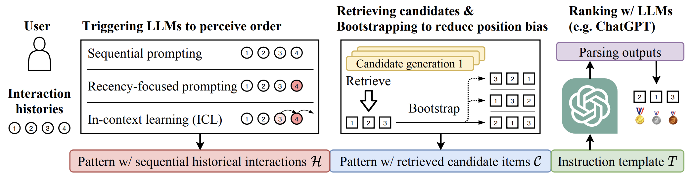

# LLMRank

Code to reproduce the experiments for the paper:

> Yupeng Hou†, Junjie Zhang†, Zihan Lin, Hongyu Lu, Ruobing Xie, Julian McAuley, Wayne Xin Zhao. Large Language Models are Zero-Shot Rankers for Recommender Systems.

## LLMs as Zero-Shot Rankers



## Requirements

```
recbole==1.1.1
pytorch==1.11.0
openai==0.27.2
```

## Quick Start

Please first write your own OpenAI API keys into `openai_api.yaml`.

### Sec. 3.1, zero-shot ranking on 20 randomly retrieved candidates (including one ground-truth item)

Evaluate LLM with *sequential prompting* on ML-1M
```
python evaluate.py -m Rank
```

---

The repository is still under active construction. More code is coming soon.
