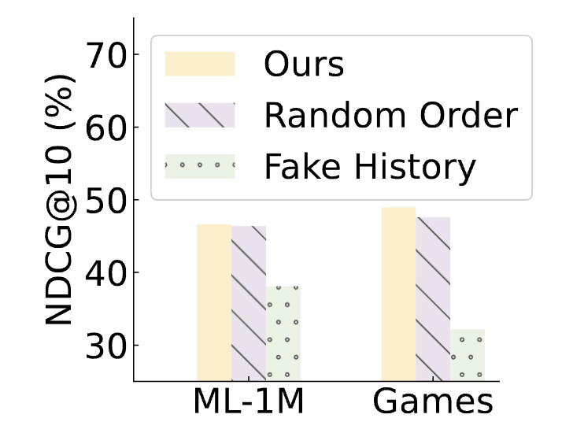
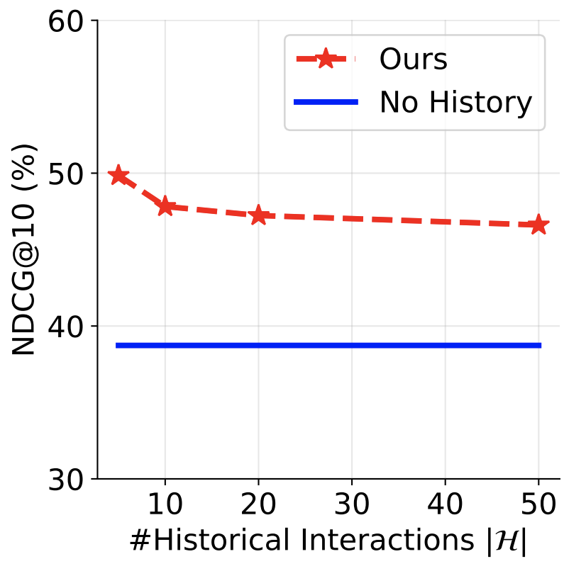
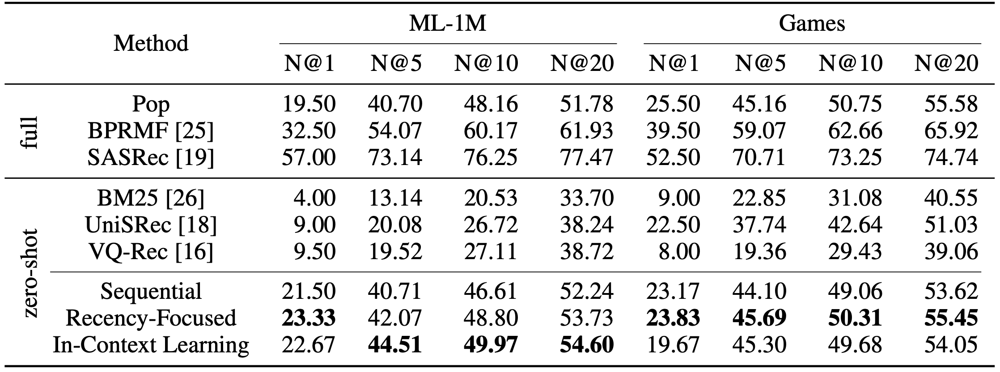

## Observation 1. LLMs struggle to perceive order of user historie, but can be triggered to perceive the orders

LLMs can utilize historical behaviors for personalized ranking, but struggle to perceive the order of the given sequential interaction histories.

By employing specifically designed promptings, such as recency-focused prompting and in-context learning, LLMs can be triggered to perceive the order of historical user behaviors, leading to improved ranking performance.


**LLMs struggle to perceive the order of the given historical user behaviors.**

<div align="center"> 

<div>Figure 2 (a)</div>
</div>

- Ours

    ```bash
    cd llmrank/

    # ML-1M
    python evaluate.py -m Rank -d ml-1m-full

    # Games
    python evaluate.py -m Rank -d Games-6k
    ```

- Ours (Random Order)

    ```bash
    cd llmrank/

    # ML-1M
    python evaluate.py -m RandOrder -d ml-1m-full

    # Games
    python evaluate.py -m RandOrder -d Games-6k
    ```

- Ours (Fake History)

    ```bash
    cd llmrank/

    # ML-1M
    python evaluate.py -m FakeHis -d ml-1m-full

    # Games
    python evaluate.py -m FakeHis -d Games-6k
    ```

<div align="center"> 

<div>Figure 2 (b)</div>
</div>

- Ours

    ```bash
    cd llmrank/

    # ML-1M
    for length in 5 10 20 50
    do
        python evaluate.py -m Rank --max_his_len=${length} -d ml-1m-full
    done
    ```


**LLMs can be triggered to perceive the orders.**

By employing specifically designed promptings, such as recency-focused prompting and in-context learning, *LLMs can be triggered to perceive the order* of historical user behaviors, leading to improved ranking performance.

<div align="center"> 

<div>Table 2</div>
</div>

#### Zero-Shot Methods

**Ours**

- Sequential [[code]](../llmrank/model/rank.py)

    ```bash
    cd llmrank/

    # ML-1M
    python evaluate.py -m Rank -d ml-1m-full

    # Games
    python evaluate.py -m Rank -d Games-6k
    ```

- Recency-Focused [[code]](../llmrank/model/rf.py)

    ```bash
    cd llmrank/

    # ML-1M
    python evaluate.py -m RF -d ml-1m-full

    # Games
    python evaluate.py -m RF -d Games-6k
    ```

- In-Context Learning [[code]](../llmrank/model/icl.py)

    ```bash
    cd llmrank/

    # ML-1M
    python evaluate.py -m ICL -d ml-1m-full

    # Games
    python evaluate.py -m ICL -d Games-6k
    ```

**Baselines**

- BM25

    ```bash
    cd llmrank/

    # ML-1M
    python evaluate.py -m BM25 -d ml-1m-full

    # Games
    python evaluate.py -m BM25 -d Games-6k
    ```

- UniSRec

    Download `*.feat1CLS` and `*_item_dataset2row.npy` from [[link]](https://drive.google.com/drive/folders/16hdqUCNOj9M1dApWYN0iGND_0WoMRyGh?usp=share_link), and download `UniSRec-FHCKM-300.pth` from [[link]](https://drive.google.com/drive/folders/17Em-qAhZ8ybcBah3EdmAcQWfn1D8ONh-?usp=sharing).

    ```bash
    cd llmrank/

    # ML-1M
    python evaluate.py -m UniSRec -d ml-1m-full -p pretrained_models/UniSRec-FHCKM-300.pth

    # Games
    python evaluate.py -m UniSRec -d Games-6k -p pretrained_models/UniSRec-FHCKM-300.pth
    ```

- VQ-Rec

    Download `*.OPQ32,IVF1,PQ32x8.index` from [[link]](https://drive.google.com/drive/folders/16hdqUCNOj9M1dApWYN0iGND_0WoMRyGh?usp=share_link), and download `VQRec-FHCKM-300-20230315.pth` from [[link]](https://drive.google.com/drive/folders/17Em-qAhZ8ybcBah3EdmAcQWfn1D8ONh-?usp=sharing).

    ```bash
    cd llmrank/

    # ML-1M
    python evaluate.py -m VQRec -d ml-1m-full -p pretrained_models/VQRec-FHCKM-300-20230315.pth

    # Games
    python evaluate.py -m VQRec -d Games-6k -p pretrained_models/VQRec-FHCKM-300-20230315.pth
    ```

#### Conventional Methods

> Pre-trained models can be downloaded following the instructions in [[downloading pre-trained models]](../llmrank/pretrained_models/README.md).

- BPRMF

    ```bash
    cd llmrank/

    # ML-1M
    # python run_baseline.py -m BPR -d ml-1m
    # mv xxx.pth pretrained_models/BPR-ml-1m.pth
    python evaluate.py -m BPR -d ml-1m-full -p pretrained_models/BPR-ml-1m.pth

    # Games
    # python run_baseline.py -m BPR -d Games
    # mv xxx.pth pretrained_models/BPR-Games.pth
    python evaluate.py -m BPR -d Games-6k -p pretrained_models/BPR-Games.pth
    ```

- Pop

    ```bash
    cd llmrank/

    # ML-1M
    # python run_baseline.py -m Pop -d ml-1m
    # mv xxx.pth pretrained_models/Pop-ml-1m.pth
    python evaluate.py -m Pop -d ml-1m-full -p pretrained_models/Pop-ml-1m.pth

    # Games
    # python run_baseline.py -m Pop -d Games
    # mv xxx.pth pretrained_models/Pop-Games.pth
    python evaluate.py -m Pop -d Games-6k -p pretrained_models/Pop-Games.pth
    ```

- SASRec

    ```bash
    cd llmrank/

    # ML-1M
    # python run_baseline.py -m SASRec -d ml-1m
    # mv xxx.pth pretrained_models/SASRec-ml-1m.pth
    python evaluate.py -m SASRec -d ml-1m-full -p pretrained_models/SASRec-ml-1m.pth

    # Games
    # python run_baseline.py -m SASRec -d Games
    # mv xxx.pth pretrained_models/SASRec-Games.pth
    python evaluate.py -m SASRec -d Games-6k -p pretrained_models/SASRec-Games.pth
    ```

