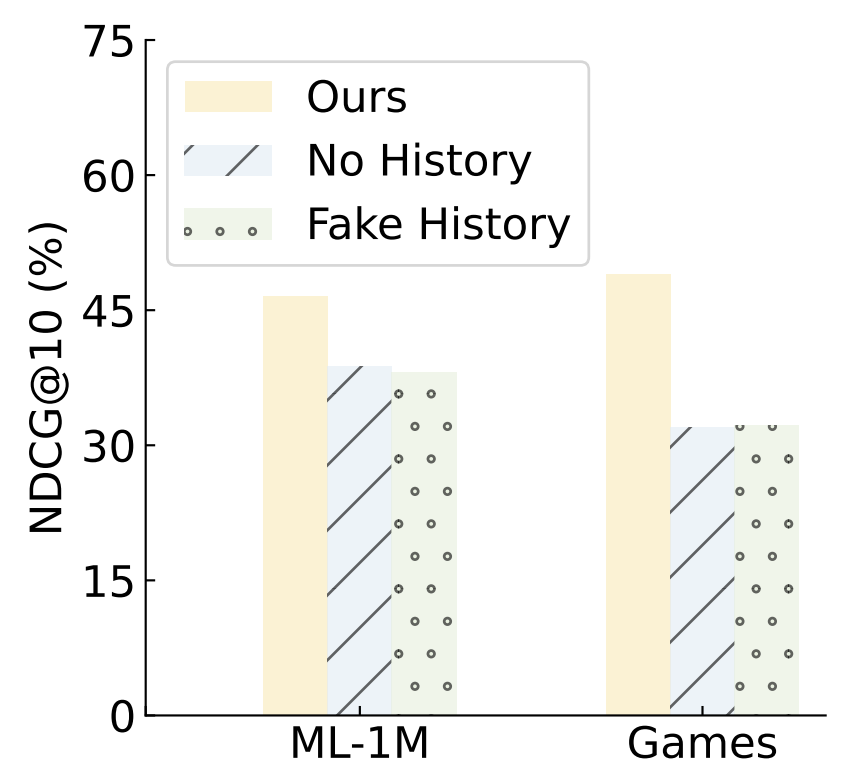

## Observation 1. LLMs struggle to perceive order of user histories

LLMs can utilize historical behaviors for personalized ranking, but *struggle to perceive the order* of the given sequential interaction histories.

**LLMs can give personalized recommendations corresponding to prompts with historical behaviors.**

<div  align="center"> 

<div>Figure 2 (a)</div>
</div>

- Ours

    ```bash
    cd llmrank/

    # ML-1M
    python evaluate.py -m Rank

    # Games
    python evaluate.py -m Rank -d Games
    ```

- No History

    ```bash
    cd llmrank/

    # ML-1M
    python evaluate.py -m NoHis

    # Games
    python evaluate.py -m NoHis -d Games
    ```

- Fake History

    ```bash
    cd llmrank/

    # ML-1M
    python evaluate.py -m FakeHis

    # Games
    python evaluate.py -m FakeHis -d Games
    ```
