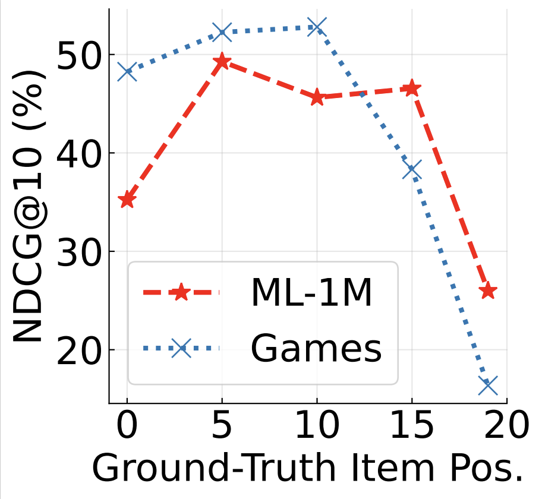
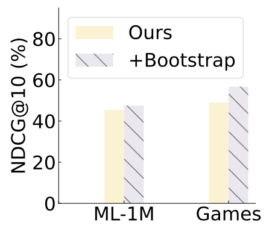
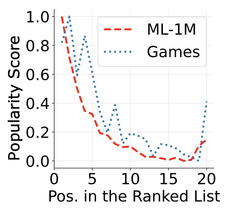
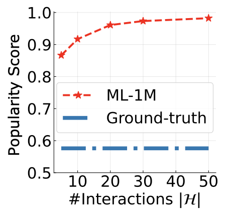

## Observation 2. LLMs suffer from position bias and popularity bias 

LLMs suffer from position bias and popularity bias while ranking, which can be alleviated by specially designed prompting or bootstrapping strategies.


**The order of candidates affects the ranking results of LLMs**

<div align="center"> 

<div>Figure 3 (a)</div>
</div>

We vary the position of ground-truth items at {0, 5, 10, 15, 19} and present the ranking results in Figure 3 (a).

- We first write a bash script file.

    ```bash
    # ML-1M
    for pos in 0 5 10 15 19 ; do
      python evaluate.py -m Rank -d ml-1m-full --fix_pos=$pos
    done
    ```
    ```bash
    # Games
    for pos in 0 5 10 15 19 ; do
      python evaluate.py -m Rank -d Games-6k --fix_pos=$pos
    done
    ```
 - Then we execute the bash script file.
    ```bash
    cd llmrank/
    
    bash pos_bias.sh
    ```

**Alleviating position bias via bootstrapping**

<div align="center"> 

<div>Figure 3 (b)</div>
</div>

We rank the candidate set repeatedly for $B$ times, with candidates randomly shuffled at each round.

- Ours

    ```bash
    cd llmrank/

    # ML-1M
    python evaluate.py -m Rank -d ml-1m-full

    # Games
    python evaluate.py -m Rank -d Games-6k
    ```

- Ours + bootstrapping

    ```bash
    cd llmrank/

    # ML-1M
    python evaluate.py -m Rank -d ml-1m-full --boots=3

    # Games
    python evaluate.py -m Rank -d Games-6k --boots=3
    ```

**Popularity degrees of candidates affect ranking results of LLMs**

<div align="center"> 

<div>Figure 3 (c)</div>
</div>


We report the item popularity score at each position of the ranked item lists (parsed from logs).

    ```bash
    cd llmrank/

    # ML-1M
    python parse_pop.py -m Rank -lp Rank-ml-1m-Jun-07-2023_13-09-03-3c1e76.log

    # Games
    python parse_pop.py -m Rank -d Games -lp Rank-Games-Jun-07-2023_13-09-05-55eec9.log
    ```

```-lp``` refers to path of log file, which should be replaced by the real file generated by our project.

**Making LLMs focus on historical interactions helps reduce popularity bias**

<div align="center"> 

<div>Figure 3 (d)</div>
</div>

We instruct LLMs to focus on histroical interacctions, thereby reducing the effects of popularity bias.
- We first write a bash script file.

    ```bash
    # ML-1M
    for his_len in 5 10 20 30 40 50 ; do
      python evaluate.py -m Rank -d ml-1m-full --max_his_len=$his_len
    done
    ```
    ```bash
    # Games
    for his_len in 5 10 20 30 40 50 ; do
      python evaluate.py -m Rank -d Games-6k --max_his_len=$his_len
    done
    ```
 - Then we execute the bash script file.
    ```bash
    cd llmrank/
    
    bash alleviate_pop_bias.sh
    ```
   
