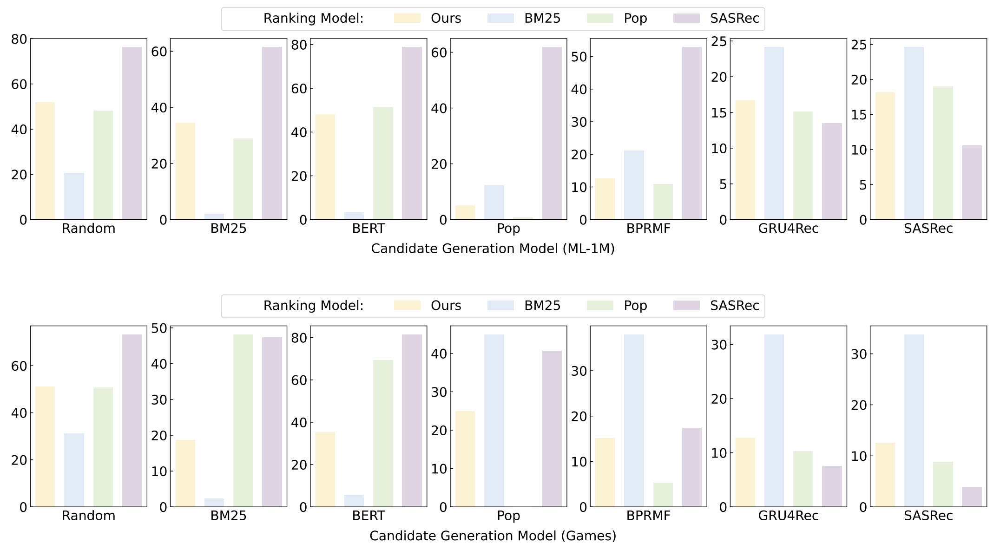

## Observation 3. Promising zero-shot ranking abilities

LLMs have promising zero-shot ranking abilities, especially on candidates retrieved by multiple candidate generation models with different practical strategies.

**LLMs have promising zero-shot ranking abilities.**

Please refer to [Table 2](./ob2-trigger-llms-to-perceive-order.md).

**LLMs rank candidates based on item popularity, text features as well as user behaviors.**

<div align="center"> 

<div>Figure 3</div>
</div>

For the scripts about generating `.bm25` et al., please refer to [[data-preparation]](../llmrank/dataset/data-preparation.md).

- Ours (Ranking Model)

    ```bash
    cd llmrank/

    for dataset in ml-1m Games
    do
        # Random (Candidate Generation Model)
        python evaluate.py -m Rank -d ${dataset} --max_his_len=5

        # BM25 (Candidate Generation Model)
        python evaluate.py -m Rank -d ${dataset} --max_his_len=5 --selected_user_suffix=bm25

        # BERT (Candidate Generation Model)
        python evaluate.py -m Rank -d ${dataset} --max_his_len=5 --selected_user_suffix=bert
    done
    ```

- BM25 (Ranking Model)

    ```bash
    cd llmrank/

    for dataset in ml-1m Games
    do
        # Random (Candidate Generation Model)
        python evaluate.py -m BM25 -d ${dataset}

        # BM25 (Candidate Generation Model)
        python evaluate.py -m BM25 -d ${dataset} --selected_user_suffix=bm25

        # BERT (Candidate Generation Model)
        python evaluate.py -m BM25 -d ${dataset} --selected_user_suffix=bert
    done
    ```

- Pop (Ranking Model)

    ```bash
    cd llmrank/

    for dataset in ml-1m Games
    do
        # Random (Candidate Generation Model)
        python evaluate.py -m Pop -d ${dataset} -p pretrained_models/Pop-${dataset}.pth

        # BM25 (Candidate Generation Model)
        python evaluate.py -m Pop -d ${dataset} -p pretrained_models/Pop-${dataset}.pth --selected_user_suffix=bm25

        # BERT (Candidate Generation Model)
        python evaluate.py -m Pop -d ${dataset} -p pretrained_models/Pop-${dataset}.pth --selected_user_suffix=bert
    done
    ```

- SASRec (Ranking Model)

    ```bash
    cd llmrank/

    for dataset in ml-1m Games
    do
        # Random (Candidate Generation Model)
        python evaluate.py -m SASRec -d ${dataset} -p pretrained_models/SASRec-${dataset}.pth

        # BM25 (Candidate Generation Model)
        python evaluate.py -m SASRec -d ${dataset} -p pretrained_models/SASRec-${dataset}.pth --selected_user_suffix=bm25

        # BERT (Candidate Generation Model)
        python evaluate.py -m SASRec -d ${dataset} -p pretrained_models/SASRec-${dataset}.pth --selected_user_suffix=bert
    done
    ```
