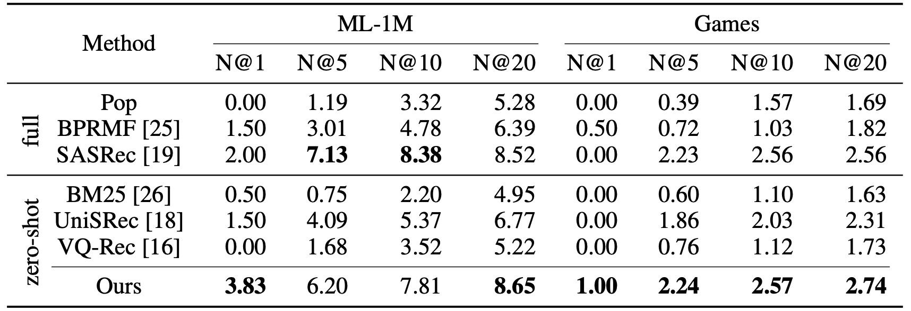
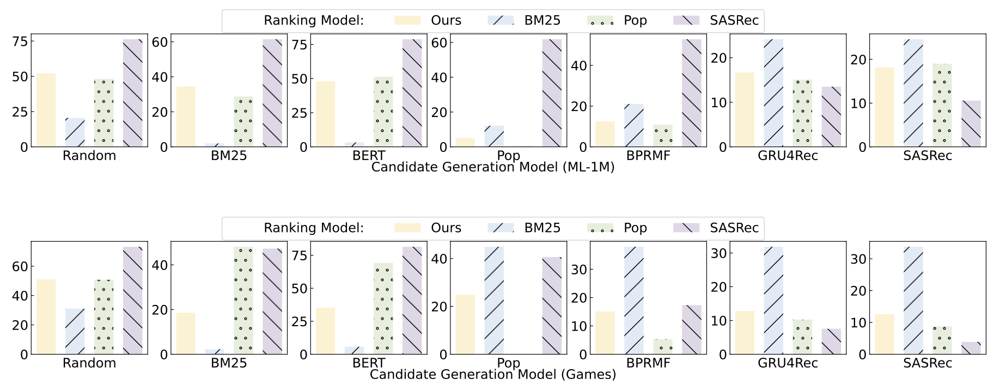
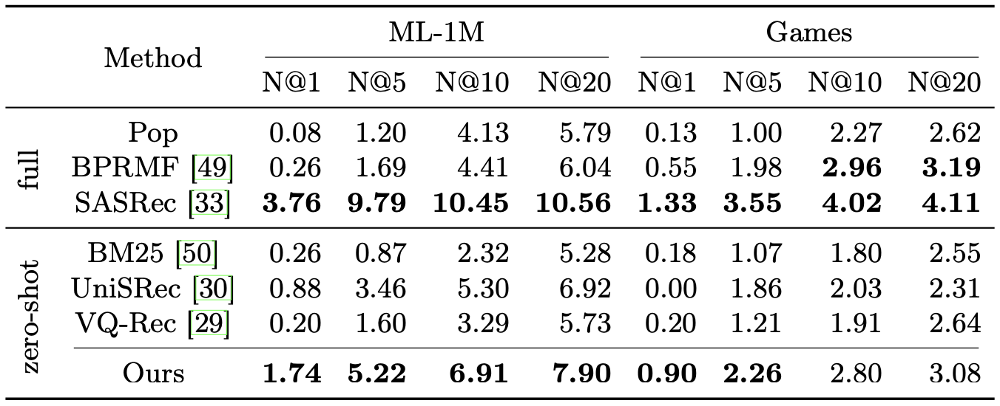

## Observation 3. Promising zero-shot ranking abilities

LLMs have promising zero-shot ranking abilities, especially on candidates retrieved by multiple candidate generation models with different practical strategies.

**LLMs have promising zero-shot ranking abilities.**

<div align="center"> 

<div>Table 3</div>
</div>

**LLMs**

- ChatGPT [[code]](../llmrank/model/rf.py)

    ```bash
    cd llmrank/

    # ML-1M
    python evaluate.py -m RF -d ml-1m

    # Games
    python evaluate.py -m RF -d Games
    ```

- GPT-4 [[code]](../llmrank/model/rf.py)

    ```bash
    cd llmrank/

    # ML-1M
    python evaluate.py -m RF -d ml-1m --api_name=gpt-4

    # Games
    python evaluate.py -m RF -d Games --api_name=gpt-4
    ```

**Baselines**

- BM25

    ```bash
    cd llmrank/

    # ML-1M
    python evaluate.py -m BM25 -d ml-1m

    # Games
    python evaluate.py -m BM25 -d Games
    ```

- UniSRec


    ```bash
    cd llmrank/

    # ML-1M
    python evaluate.py -m UniSRec -d ml-1m -p pretrained_models/UniSRec-FHCKM-300.pth

    # Games
    python evaluate.py -m UniSRec -d Games -p pretrained_models/UniSRec-FHCKM-300.pth
    ```

**LLMs rank candidates based on item popularity, text features as well as user behaviors.**

<div align="center"> 

<div>Figure 4</div>
</div>

For the scripts about generating `.bm25` et al., please refer to [[data-preparation]](../llmrank/dataset/data-preparation.md).

- Ours (Ranking Model)

    ```bash
    cd llmrank/

    for dataset in ml-1m Games
    do
        for suffix in random bm25 bert pop
        do
            python evaluate.py -m Rank -d ${dataset} --max_his_len=5 --selected_user_suffix=${suffix}
        done
    done
    ```

- BM25 (Ranking Model)

    ```bash
    cd llmrank/

    for dataset in ml-1m Games
    do
        for suffix in random bm25 bert pop
        do
            python evaluate.py -m BM25 -d ${dataset} --selected_user_suffix=${suffix}
        done
    done
    ```

- Pop (Ranking Model)

    ```bash
    cd llmrank/

    for dataset in ml-1m Games
    do
        for suffix in random bm25 bert pop
        do
            python evaluate.py -m Pop -d ${dataset} -p pretrained_models/Pop-${dataset}.pth --selected_user_suffix=${suffix}
        done
    done
    ```

- SASRec (Ranking Model)

    ```bash
    cd llmrank/

    for dataset in ml-1m Games
    do
        for suffix in random bm25 bert pop
        do
            python evaluate.py -m SASRec -d ${dataset} -p pretrained_models/SASRec-${dataset}.pth --selected_user_suffix=${suffix}
        done
    done
    ```

**LLMs can effectively rank candidates retrieved by multiple candidate generation models.**

<div align="center"> 

<div>Table 3</div>
</div>

> For the preprocessing code and scripts of `*.rabmbepobpgrsa_3`, please refer to [[data-preparation]](../llmrank/dataset/data-preparation.md).

### Zero-Shot Methods

**LLM-based Ranking Model**

- Ours

    ```bash
    cd llmrank/

    # ML-1M
    python evaluate.py -m RF -d ml-1m-full \
        --boots=3 \
        --max_his_len=5 \
        --recall_budget=21 \
        --has_gt=False \
        --selected_user_suffix=rabmbepobpgrsa_3

    # Games
    python evaluate.py -m RF -d Games-6k \
        --boots=3 \
        --max_his_len=5 \
        --recall_budget=21 \
        --has_gt=False \
        --selected_user_suffix=rabmbepobpgrsa_3
    ```

**Baselines**

- BM25

    ```bash
    cd llmrank/

    # ML-1M
    python evaluate.py -m BM25 -d ml-1m-full --recall_budget=21 --has_gt=False --selected_user_suffix=rabmbepobpgrsa_3

    # Games
    python evaluate.py -m BM25 -d Games-6k --recall_budget=21 --has_gt=False --selected_user_suffix=rabmbepobpgrsa_3
    ```

- UniSRec

    Download `*.feat1CLS` and `*_item_dataset2row.npy` from [[link]](https://drive.google.com/drive/folders/16hdqUCNOj9M1dApWYN0iGND_0WoMRyGh?usp=share_link), and download `UniSRec-FHCKM-300.pth` from [[link]](https://drive.google.com/drive/folders/17Em-qAhZ8ybcBah3EdmAcQWfn1D8ONh-?usp=sharing).

    ```bash
    cd llmrank/

    # ML-1M
    python evaluate.py -m UniSRec -d ml-1m-full --recall_budget=21 --has_gt=False -p pretrained_models/UniSRec-FHCKM-300.pth --selected_user_suffix=rabmbepobpgrsa_3

    # Games
    python evaluate.py -m UniSRec -d Games-6k --recall_budget=21 --has_gt=False -p pretrained_models/UniSRec-FHCKM-300.pth --selected_user_suffix=rabmbepobpgrsa_3
    ```

- VQ-Rec

    Download `*.OPQ32,IVF1,PQ32x8.index` from [[link]](https://drive.google.com/drive/folders/16hdqUCNOj9M1dApWYN0iGND_0WoMRyGh?usp=share_link), and download `VQRec-FHCKM-300-20230315.pth` from [[link]](https://drive.google.com/drive/folders/17Em-qAhZ8ybcBah3EdmAcQWfn1D8ONh-?usp=sharing).

    ```bash
    cd llmrank/

    # ML-1M
    python evaluate.py -m VQRec -d ml-1m-full --recall_budget=21 --has_gt=False -p pretrained_models/VQRec-FHCKM-300-20230315.pth --selected_user_suffix=rabmbepobpgrsa_3

    # Games
    python evaluate.py -m VQRec -d Games-6k --recall_budget=21 --has_gt=False -p pretrained_models/VQRec-FHCKM-300-20230315.pth --selected_user_suffix=rabmbepobpgrsa_3
    ```

### Conventional Methods

> Pre-trained models can be downloaded following the instructions in [[downloading pre-trained models]](../llmrank/pretrained_models/README.md).

- BPRMF

    ```bash
    cd llmrank/

    # ML-1M
    # python run_baseline.py -m BPR -d ml-1m
    # mv xxx.pth pretrained_models/BPR-ml-1m.pth
    python evaluate.py -m BPR -d ml-1m-full --recall_budget=21 --has_gt=False -p pretrained_models/BPR-ml-1m.pth --selected_user_suffix=rabmbepobpgrsa_3

    # Games
    # python run_baseline.py -m BPR -d Games
    # mv xxx.pth pretrained_models/BPR-Games.pth
    python evaluate.py -m BPR -d Games-6k --recall_budget=21 --has_gt=False -p pretrained_models/BPR-Games.pth --selected_user_suffix=rabmbepobpgrsa_3
    ```

- Pop

    ```bash
    cd llmrank/

    # ML-1M
    # python run_baseline.py -m Pop -d ml-1m
    # mv xxx.pth pretrained_models/Pop-ml-1m.pth
    python evaluate.py -m Pop -d ml-1m-full --recall_budget=21 --has_gt=False -p pretrained_models/Pop-ml-1m.pth --selected_user_suffix=rabmbepobpgrsa_3

    # Games
    # python run_baseline.py -m Pop -d Games
    # mv xxx.pth pretrained_models/Pop-Games.pth
    python evaluate.py -m Pop -d Games-6k --recall_budget=21 --has_gt=False -p pretrained_models/Pop-Games.pth --selected_user_suffix=rabmbepobpgrsa_3
    ```

- SASRec

    ```bash
    cd llmrank/

    # ML-1M
    # python run_baseline.py -m SASRec -d ml-1m
    # mv xxx.pth pretrained_models/SASRec-ml-1m.pth
    python evaluate.py -m SASRec -d ml-1m-full --recall_budget=21 --has_gt=False -p pretrained_models/SASRec-ml-1m.pth --selected_user_suffix=rabmbepobpgrsa_3

    # Games
    # python run_baseline.py -m SASRec -d Games
    # mv xxx.pth pretrained_models/SASRec-Games.pth
    python evaluate.py -m SASRec -d Games-6k --recall_budget=21 --has_gt=False -p pretrained_models/SASRec-Games.pth --selected_user_suffix=rabmbepobpgrsa_3
    ```
